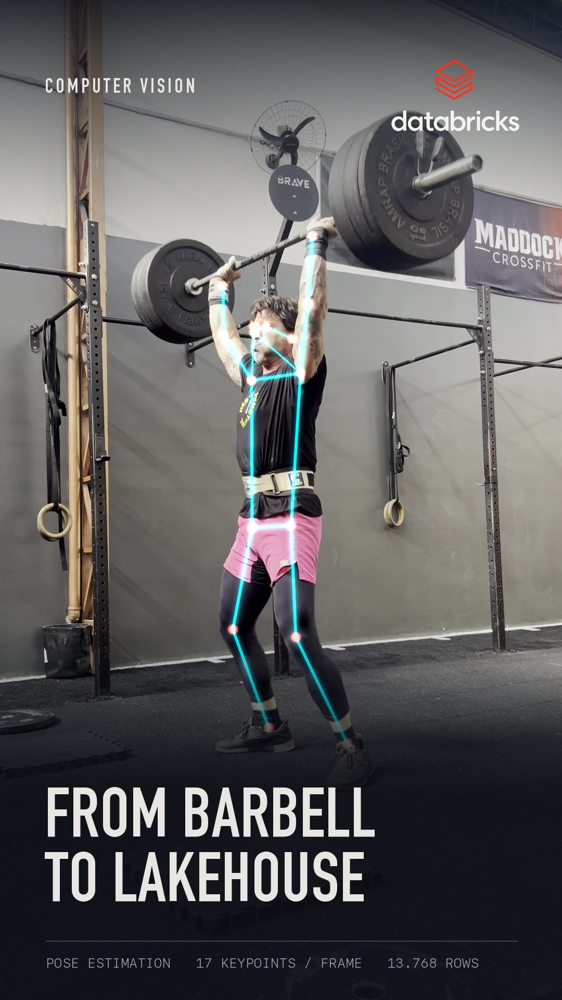

# Barbell → Lakehouse

Turn a phone video of a lift into a neon pose overlay where every keypoint
becomes a record flowing into a data pipeline.



YOLOv8-pose tracks the athlete across the clip. The 17 COCO keypoints are drawn
as a thin cyan skeleton with red joints, and each detected joint emits a
particle that falls onto a conveyor line, runs right, and is absorbed by the
mark at the end of the pipeline — which pulses on every arrival. A live counter
tallies the records as they land.

## Why three passes

Inference is expensive and the visual treatment is not. Splitting them means
you can iterate on the look without re-running the model, and it keeps the HUD
stable across a crossfade — cutting two clips that each carry their own HUD
double-exposes the counter digits for the length of the transition.

| Pass | Script | Does |
| --- | --- | --- |
| 1 | `extract_pose.py` | Runs YOLO once, caches keypoints to `.npz` |
| 2 | `render_pipeline.py` | Draws skeleton, particles, conveyor |
| 3 | `apply_hud.py` | Lays type, logo and counter over the finished cut |
| — | `make_thumb.py` | Builds a vertical cover frame from any frame index |

## Setup

```bash
pip install -r requirements.txt
```

Fetch a pose checkpoint — `yolov8n-pose.pt` is fast, `yolov8x-pose.pt` is what
the cover was rendered with:

```bash
yolo export model=yolov8x-pose.pt format=torchscript
```

`--logo` takes any PNG with an alpha channel. This repo intentionally ships
without one: if you want the Databricks mark, download it from the
[Databricks brand assets](https://www.databricks.com/company/newsroom/brand-assets)
and respect their trademark guidelines. Any other mark works too.

The HUD uses DIN Condensed and SF Mono, which ship with macOS. On Linux the
scripts fall back to DejaVu/Liberation, or point them anywhere you like:

```bash
export POSE_FONT_DISPLAY=/path/to/condensed-bold.ttf
export POSE_FONT_MONO=/path/to/mono.ttf
```

## Run it

Phone footage usually carries a rotation flag that OpenCV ignores, so normalize
first — this applies the rotation and scales to a 1080-wide vertical frame:

```bash
ffmpeg -i IMG_0658.MOV -vf "scale=1080:-2" -c:v libx264 -crf 18 -an clip_a.mp4
```

Cache the poses, then render each clip without the HUD:

```bash
python extract_pose.py clip_a.mp4 clip_a.npz --weights yolov8x-pose.pt
python render_pipeline.py clip_a.mp4 clip_a.npz a.mp4 --logo mark.png --no-hud
```

Crossfade the clips, then lay the HUD over the cut so the counter runs
continuously through the transition:

```bash
ffmpeg -i a.mp4 -i b.mp4 -filter_complex \
  "[0:v]fps=60,settb=AVTB[a];[1:v]fps=60,settb=AVTB[b];\
   [a][b]xfade=transition=fade:duration=0.6:offset=8.65[v]" \
  -map "[v]" -c:v ffv1 cut.mkv

python apply_hud.py cut.mkv final.mp4 --logo mark.png \
  --segment 0:CLIP_A --segment 537:CLIP_B --records-total 13804
```

`--segment START_FRAME:LABEL` switches the source label mid-cut; put the second
one at the middle of the fade. `--records-total` is `frames × 17`.

Cover frame from any index:

```bash
python make_thumb.py clip_b.mp4 clip_b.npz 215 cover.png --logo mark.png
```

## Knobs worth turning

- `--emit-every` — frames between particle emissions. Lower is denser; below 2
  it reads as noise rather than data.
- `KP_CONF` in `render_pipeline.py` — keypoint confidence floor. Raising it
  drops jittery limbs during occlusion, at the cost of a sparser skeleton.
- `LINE_Y`, `LOGO_CX`, `LOGO_W` — conveyor and mark geometry.

## Known limits

- The athlete is picked as the largest person per frame. That's enough for a
  single lifter with bystanders in the background, but it isn't identity
  tracking — it will swap if someone walks closer to the camera than the
  subject.
- Pose gets unreliable under heavy self-occlusion; a lifter folded over the bar
  at setup produces tangled arms for a few frames.
- Geometry constants assume a 1080×1920 frame.

## License

MIT
